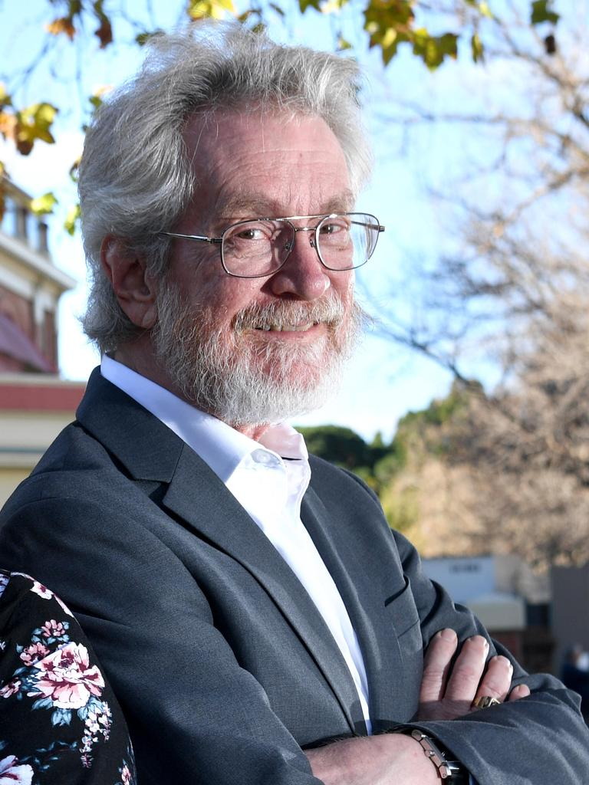

# Winter 2022
### Thursdays, 11:00am-12:20pm

 

### Jan 13th - [Marc Berman](https://github.com/uchicago-computation-workshop/Winter2022/tree/master/01-13_Berman)

### Jan 20th - [Sherry Emery](https://github.com/uchicago-computation-workshop/Winter2022/tree/master/01-20_Emery)

### Jan 27th - [Blase Ur](https://github.com/uchicago-computation-workshop/Winter2022/tree/master/01-27_Ur)

### Feb 3rd - [Zhao Wang](https://github.com/uchicago-computation-workshop/Winter2022/tree/master/02-03_Wang)

### Feb 10th - [Akram Bakkour](https://github.com/uchicago-computation-workshop/Winter2022/tree/master/02-10_Bakkour)

### Feb 17th - [Robert Axtell](https://github.com/uchicago-computation-workshop/Winter2022/tree/master/02-17_Axtell)

### Feb 24th - [Yuan Chang Leong](https://github.com/uchicago-computation-workshop/Winter2022/tree/master/02-24_Leong)

### March 3rd- [Joshua Epstein](https://github.com/uchicago-computation-workshop/Winter2022/tree/master/03-03_Epstein)

### March 10th- [Alex "Sandy" Pentland](https://github.com/uchicago-computation-workshop/Winter2022/tree/master/03-10_Pentland)

